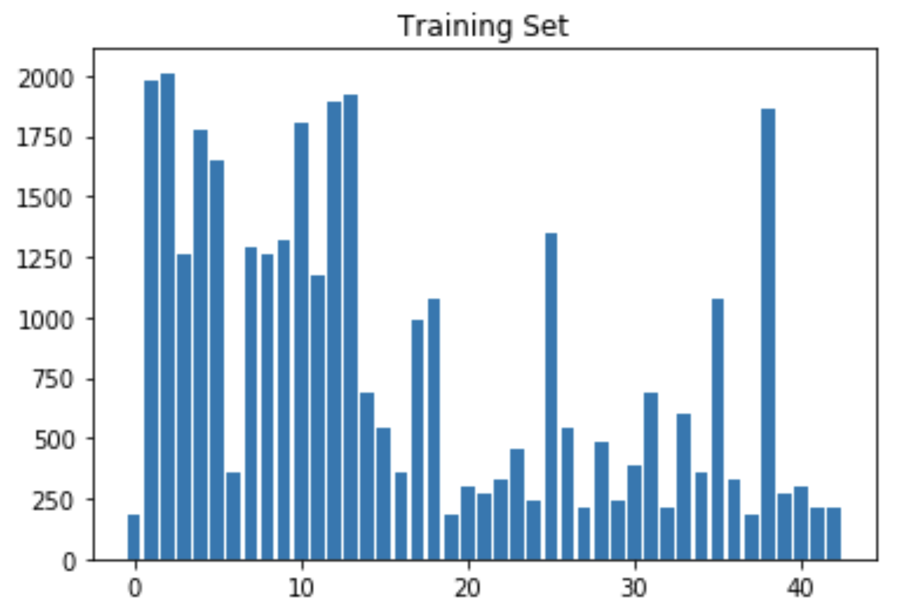
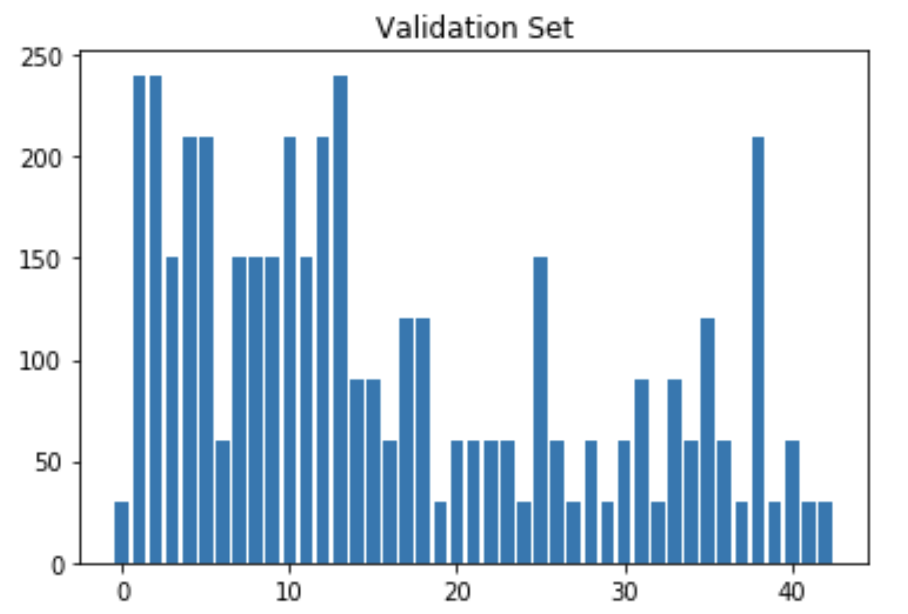
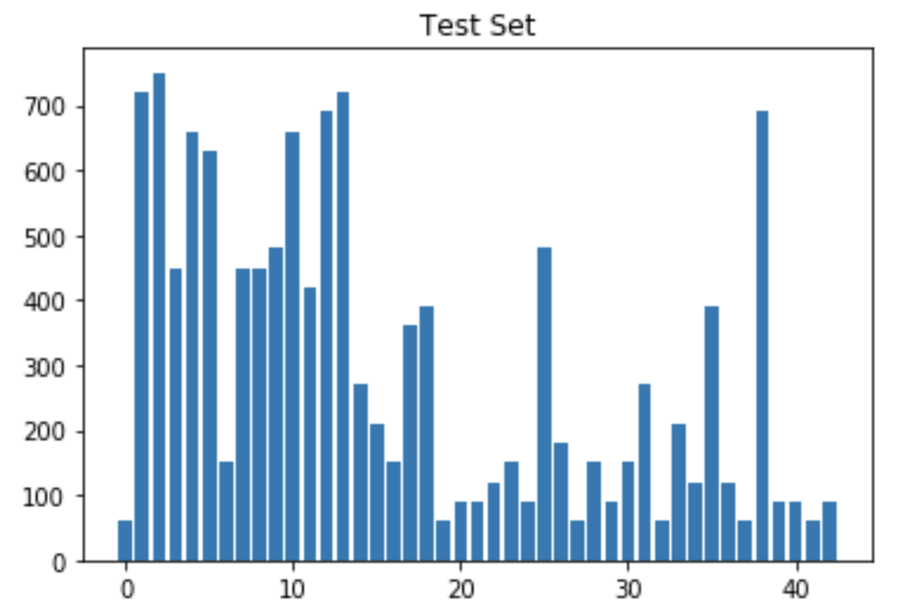
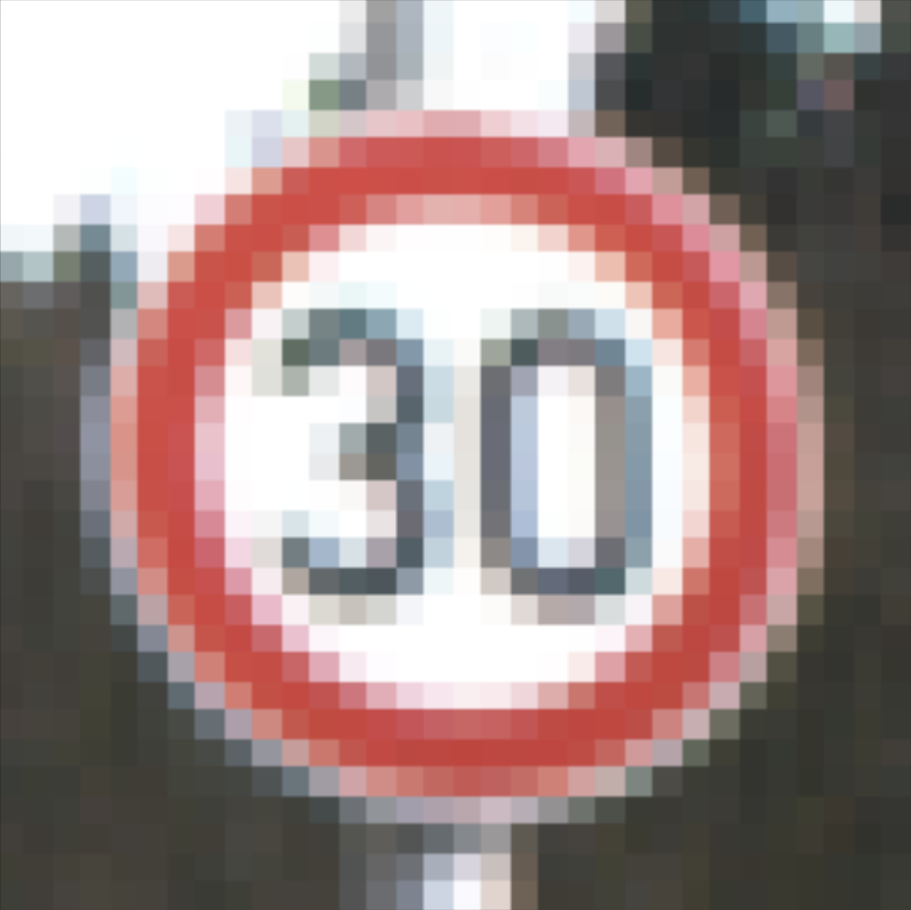
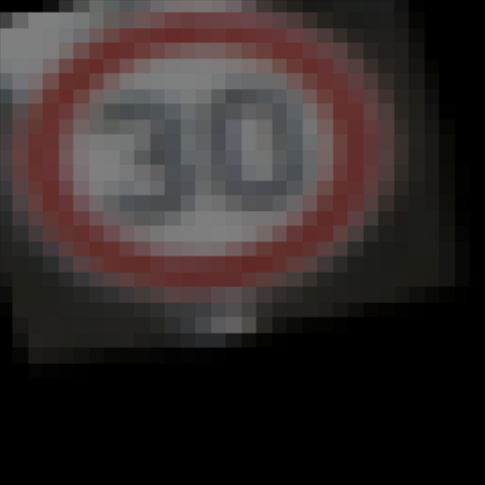
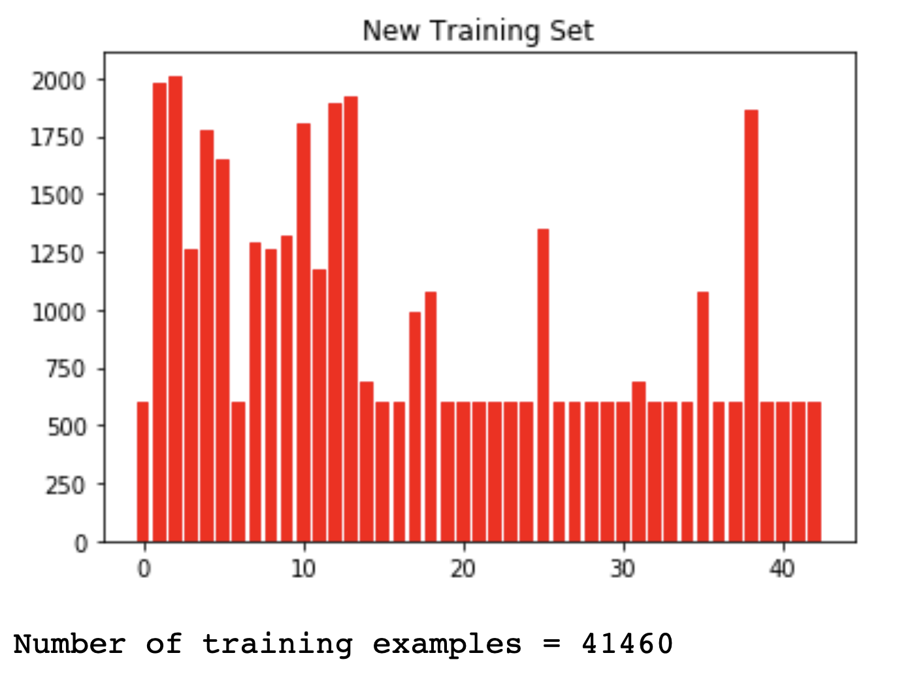
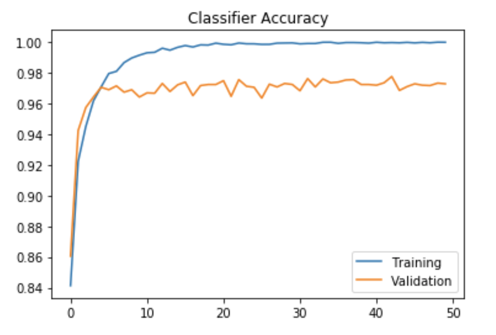

# **Traffic Sign Recognition** 

---

**Build a Traffic Sign Recognition Project**

The goals / steps of this project are the following:

* Load the data set (see below for links to the project data set)
* Explore, summarize and visualize the data set
* Design, train and test a model architecture
* Use the model to make predictions on new images
* Analyze the softmax probabilities of the new images
* Summarize the results with a written report

## Rubric Points
### Here I will consider the [rubric points](https://review.udacity.com/#!/rubrics/481/view) individually and describe how I addressed each point in my implementation.  

---
### Writeup / README

#### 1. Provide a Writeup / README that includes all the rubric points and how you addressed each one. You can submit your writeup as markdown or pdf. You can use this template as a guide for writing the report. The submission includes the project code.

You're reading it! and here is a link to my [project code](https://github.com/wlsmith42/Traffic-Sign-Classifier/Traffic_Sign_Classifier.ipynb)

### Data Set Summary & Exploration

#### 1. Provide a basic summary of the data set. In the code, the analysis should be done using python, numpy and/or pandas methods rather than hardcoding results manually.

I used python and the numpy library to calculate summary statistics of the traffic signs data set:

* The size of training set is 34,799
* The size of the validation set is 4,410
* The size of test set is 12,630
* The shape of a traffic sign image is (32, 32, 3)
* The number of unique classes/labels in the data set is 43

#### 2. Include an exploratory visualization of the dataset.

Here is an exploratory visualization of the data set. It is a bar chart showing the number of instances of each class in the training, validation and test sets.

  
   
   

### Design and Test a Model Architecture

#### 1. Describe how you preprocessed the image data. What techniques were chosen and why did you choose these techniques? Consider including images showing the output of each preprocessing technique. Pre-processing refers to techniques such as converting to grayscale, normalization, etc. (OPTIONAL: As described in the "Stand Out Suggestions" part of the rubric, if you generated additional data for training, describe why you decided to generate additional data, how you generated the data, and provide example images of the additional data. Then describe the characteristics of the augmented training set like number of images in the set, number of images for each class, etc.)

I chose to leave the images in RGB color space because that increases the depth of the network and generally allows more data through to help classify an image.  

To normalize the images, found in code cell #12 in the jupyter notebook, I subtracted the minimum image threshold from each image in the dataset, then divided the result by the range of brightness/color in the entire dataset. This helped to remove outliers from the dataset that could decrease the classifier's accuracy. After numerous tests, I found that less normalization provided higher accuracy, so I chose to leave the preprocessing to outlier reduction.

In addition to normalization, I generated additional data in the training set to account for classes that had fewer than 600 occurrences in the dataset. The data was augmented based on the following characteristics:

* Rotating the Image
* Skewing the Image
* Shearing the Image
* Changing Image Brightness

Each value was picked at random to ensure that no two generated images were the same. Here is an example of a speed limit sign image before augmentation:

  

And this is one example of augmenting the image to add to the training dataset:

  

By augmenting all classes in the training set, I was able to add 6,661 images to the dataset resulting in the following distribution among classes:

  

#### 2. Describe what your final model architecture looks like including model type, layers, layer sizes, connectivity, etc.) Consider including a diagram and/or table describing the final model.

My final model consisted of the following layers:

| Layer         		    |     Description	        				 | 
|:---------------------:|:---------------------------------------------:| 
| Input         	    	| 32x32x3 RGB image   							| 
| Convolution 5x5     	| 1x1 stride, valid padding, outputs 28x28x16        	                    |
| Relu				       |												|
| Average Pooling	   | 2x2 stride,  outputs 14x14x16 				          |
| Convolution 5x5	    | 1x1 stride, valid padding, outputs 10x10x64      							|
| Relu		             |        									   |
| Max Pooling			   | 2x2 stride, outputs 5x5x64       						   |
| Flatten				   |												|
| Fully Connected		| inputs 1600, outputs 800							|
| Relu						|												|
| Dropout				   |	0.4 keep probability							|
| Fully Connected		| inputs 800, outputs 256							|
| Relu						|												|
| Dropout				   | 0.4 keep probability							|
| Fully Connected		| inputs 256, outputs 43							|
 

#### 3. Describe how you trained your model. The discussion can include the type of optimizer, the batch size, number of epochs and any hyperparameters such as learning rate.

To train the model, I used the following:

* Adam Optimizer
* Batch Size is 80
* Number of Epochs is 50
* Learning Rate is 0.001
* Dropout Keep Probability is 0.4

I chose the Adam Optimizer because it allowed for moving averages of the hyperparameters to result in momentum across epochs compared to the static hyperparameters of gradient descent. After lots of tuning, I settled on a batch size of 80 and a learning rate of 0.001 simply because this combination resulted in the highest accuracy. A keep probability of 0.4 for the dropout function worked best to prevent overfiting since my network uses 64 filters at the widest point. The balance of overfitting in the network architecture and dropout in training result in a balanced classifier. 

A graph showing the training and validation accuracy across training epochs is shown below:

  

#### 4. Describe the approach taken for finding a solution and getting the validation set accuracy to be at least 0.93. Include in the discussion the results on the training, validation and test sets and where in the code these were calculated. Your approach may have been an iterative process, in which case, outline the steps you took to get to the final solution and why you chose those steps. Perhaps your solution involved an already well known implementation or architecture. In this case, discuss why you think the architecture is suitable for the current problem.

My final model results (calculated in code cell #20 of the jupyter notebook) were: 

* training set accuracy of 1.000
* validation set accuracy of 0.973
* test set accuracy of 0.954

<b>If an iterative approach was chosen:</b>

* <b>What was the first architecture that was tried and why was it chosen?</b>
	
	I started this project with the LeNet-5 architecture. This was based on my experience with the LeNet CNN for handwriting recognition. I tested it on traffic signs and got ~80% accuracy so I decided to modify this network to increase accuracy.

* <b>What were some problems with the initial architecture?</b>

	The LeNet model was underfitting the data based on the lower accuracy.
	
* <b>How was the architecture adjusted and why was it adjusted? Typical adjustments could include choosing a different model architecture, adding or taking away layers (pooling, dropout, convolution, etc), using an activation function or changing the activation function. One common justification for adjusting an architecture would be due to overfitting or underfitting. A high accuracy on the training set but low accuracy on the validation set indicates over fitting; a low accuracy on both sets indicates under fitting.</b>

	To adjust the architecture, I first modified the pooling operations between the two 5x5 convolutions. The default for this was both max pooling, but I changed it to average pooling followed by max pooling in the next layer. After adding the pooling adjustments and the hyperparameter tuning discussed above, I was getting overfitting with high training accuracy but much lower validation accuracy. To combat this, I also added a dropout function in the fully connected layers to help compensate the now overfitted dataset.
	
* <b>Which parameters were tuned? How were they adjusted and why?</b>

	I tuned the number of epochs, the batch size, and the keep probability. Smaller batch sizes yielded higher accuracies so I chose to reduce the batch size from 128 to 80. I also increased the number of epochs from 10 to 50. This didn't provide much improvement in the long run, but helped to identify when the classifier reached it peak accuracy. Finally I started with a keep probability of 0.5, but gradually reduced it to 0.4 to improve validation accuracy.
	
* <b>What are some of the important design choices and why were they chosen? For example, why might a convolution layer work well with this problem? How might a dropout layer help with creating a successful model?</b>

	I found it was important to overfit the data within the convolutions, then apply dropout in the fully connected layers. Since this was a fairly large and diverse dataset, overfitting the data helped to identify as many characteristics of each class as possible. The dropout was then essential in the fully connected layer to randomize what information is retained and overall resulted in a very accurate classifier.

### Test a Model on New Images

#### 1. Choose five German traffic signs found on the web and provide them in the report. For each image, discuss what quality or qualities might be difficult to classify.

Here are five German traffic signs that I found on the web:

  
   
   
  
   
   

Overall, each image is very clear and should provide a good test case for the classifier. The difficulty comes in when the classifier needs to dissern between the similarities of each image. 

For example, both of the images on the left are round with similar coloring, the only difference is the "30" in the top image. Each image also has a counterpart of the same color and shape, and it is an accurate test of the classifier because not only does the classifier need to recognize basic sign types, but this shows its ability to detect small differences in signs that result in completely different classifications.

#### 2. Discuss the model's predictions on these new traffic signs and compare the results to predicting on the test set. At a minimum, discuss what the predictions were, the accuracy on these new predictions, and compare the accuracy to the accuracy on the test set.

Here are the results of the prediction:

| Image			       |     Prediction	        				           | 
|:---------------------:|:---------------------------------------------:| 
| Speed Limit (30km/h)  | Speed Limit (20km/h)   							| 
| Bumpy Road    			| Bumpy Road 									|
| Ahead Only				| Ahead Only									|
| No Vehicles	      		| No Vehicles					 				|
| Go Straight or Left	| Go Straight or Left      							|
| General Caution		| General Caution      							|

The model was able to correctly guess 5 of the 6 traffic signs, which gives an accuracy of ~83%. This is lower than the accuracy on the test set, but I believe that is due to the classifier struggling with text recognition in the speed limit signs. I believe this can be solved by adding more training data to the speed limit signs as well as increasing their resolution so the classifier can extract more features from the text.

#### 3. Describe how certain the model is when predicting on each of the five new images by looking at the softmax probabilities for each prediction. Provide the top 5 softmax probabilities for each image along with the sign type of each probability.

The code for making predictions on my final model is located in code cell #24 in the jupyter notebook. 

___

  

For the first image, the model is relatively sure that this is a speed limit sign (probability of 0.852), and the image does contain a speed limit sign although it is 30km/h not the predicted 20km/h. The correct prediction was 2nd on the softmax probabilities (probability of 0.148). The top five soft max probabilities were:

| Probability          	 |     Prediction	        				 | 
|:---------------------:|:---------------------------------------------:| 
| 0.852         			 | Speed Limit (20km/h)   							 | 
| 0.148     				 | Speed Limit (30km/h)							 |
| 0.000				    | No Vehicles								 |
| 0.000      			    | Speed Limit (50km/h)					 		 |
| 0.000				    | Speed Limit (70km/h)      							 |

___

   

For the second image, the model is completely sure that this is a bumpy road sign (probability of 1.000), and the image does contain a bumpy road sign. The top five soft max probabilities were:

| Probability         	 |     Prediction	        			    | 
|:---------------------:|:---------------------------------------------:| 
| 1.000         			 | Bumpy Road   								 | 
| 0.000     				 | Dangerous Curve to the Left 							 |
| 0.000					 | Bicycles Crossing							 |
| 0.000	      			 | Road Narrows on the Right					 		 |
| 0.000				    | Double Curve      							 |

___

 
   

For the third image, the model is completely sure that this is an ahead only sign (probability of 1.000), and the image does contain an ahead only sign. The top five soft max probabilities were:

| Probability         	 |     Prediction	        				 | 
|:---------------------:|:---------------------------------------------:| 
| 1.000         			 | Ahead Only   								 | 
| 0.000     				 | Turn Left Ahead 							 |
| 0.000					 | Go Straight or Right							 |
| 0.000	      			 | Roundabout Mandatory 					 		 |
| 0.000				    | Speed Limit (60km/h)      							 |

___

  

For the fourth image, the model is completely sure that this is a no vehicles sign (probability of 1.000), and the image does contain a no vehicles sign. The top five soft max probabilities were:

| Probability         	 |     Prediction	        				 | 
|:---------------------:|:---------------------------------------------:| 
| 1.000         			 | No Vehicles   							 | 
| 0.000     				 | Speed Limit (20km/h)							 |
| 0.000					 | Speed Limit (70km/h)							 |
| 0.000	      			 | Yield					 				    |
| 0.000				    | Keep Right      							 | 

___

  

For the fifth image, the model is completely sure that this is a go straight or left sign (probability of 1.000), and the image does contain a go straight or left sign. The top five soft max probabilities were:

| Probability         	 |     Prediction	        				 | 
|:---------------------:|:---------------------------------------------:| 
| 1.000         			 | Go Straight or Left   							 | 
| 0.000     				 | Speed Limit (20km/h) 							 |
| 0.000					 | Speed Limit (30km/h)							 |
| 0.000	      			 | Speed Limit (50km/h)					 		 |
| 0.000				    | Speed Limit (60km/h)      							 |

___

 
   

For the sixth image, the model is completely sure that this is a general caution sign (probability of 1.000), and the image does contain a general caution sign. The top five soft max probabilities were:

| Probability         	 |     Prediction	        				 | 
|:---------------------:|:---------------------------------------------:| 
| 1.000         			 | General Caution   							 | 
| 0.000     				 | Speed Limit (20km/h) 							 |
| 0.000					 | Speed Limit (30km/h)							 |
| 0.000	      			 | Speed Limit (50km/h)					 		 |
| 0.000				    | Speed Limit (60km/h)      							 |

